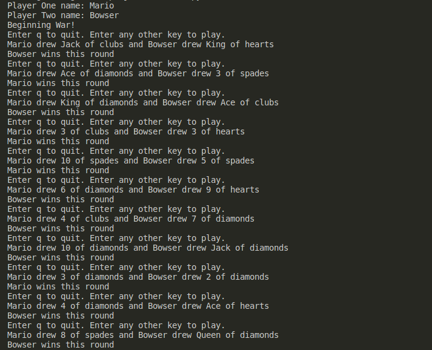
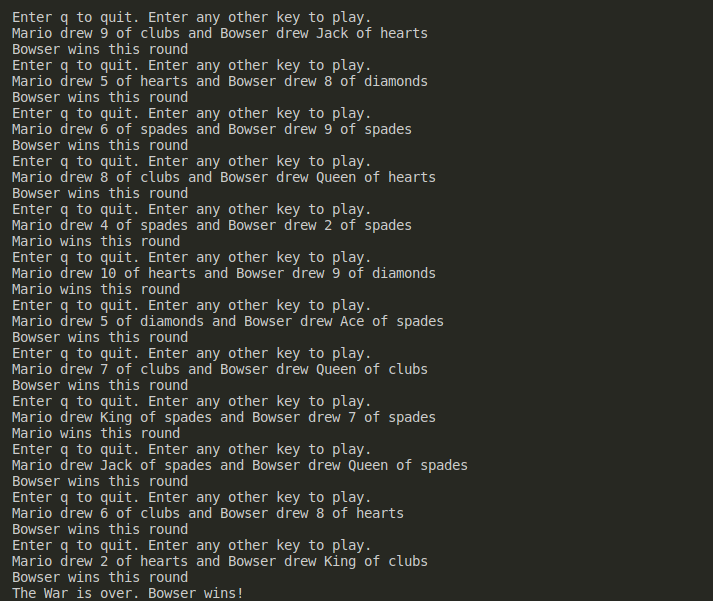

# Title

This is a solution to War from The Self-Taught Programmer by Cory Althoff.

## Table of contents

- [Title](#title)
  - [Table of contents](#table-of-contents)
  - [Overview](#overview)
    - [Screenshots](#screenshots)
    - [Link](#link)
    - [Game Rules](#game-rules)
  - [My process](#my-process)
    - [Built with](#built-with)
    - [What I learned](#what-i-learned)
    - [Continued development](#continued-development)
    - [Useful resources](#useful-resources)
  - [Author](#author)
  - [Acknowledgments](#acknowledgments)

## Overview

### Screenshots

Sample Game of War Part 1:

Sample Game of War Part 2:

### Link

- Solution URL: [War](https://github.com/jugglingdev/war)

### Game Rules

Based off of the card game War, each player draws a card from the deck.  The player with the highest card wins each round.  The game ends when all cards in the deck have been drawn.  The player with the most wins wins the game.

## My process

### Built with

- Python 3.10.6

### What I learned

YES!  This project made me so excited because, even though it is simple, it was my first project in Python using OOP principles.  I really like how classes and objects keep everything organized and it was really neat to finally see a full application of those concepts outside of smaller explanatory examples.  Context helps learning so much.

### Continued development

In future Python projects, I'm curious to learn how to work with packages and connect things to the frontend for some fabulous UI/UX practice.

### Useful resources

- [War Solution](https://github.com/calthoff/tstp/blob/master/part_II/war/war.py) - Cory's solution.

## Author

- Kayla Paden - Find me at [GitHub](https://github.com/jugglingdev), [freeCodeCamp](https://www.freecodecamp.org/jugglingdev), [Frontend Mentor](https://www.frontendmentor.io/profile/jugglingdev), [LinkedIn](https://www.linkedin.com/in/kayla-marie-paden)

## Acknowledgments

Shoutout to Cory Althoff for his clear and concise manner of teaching coding the self-taught way.  Thanks, Cory!
